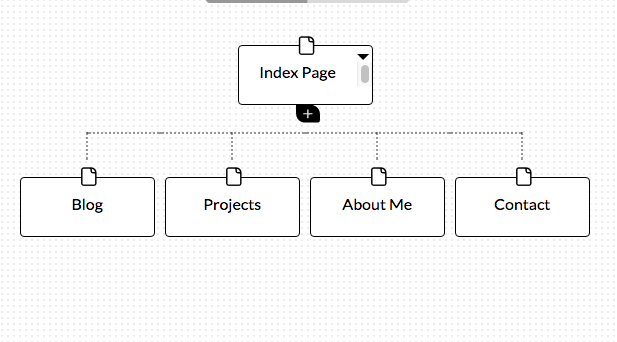

1. What are the 6 Phases of Web Design?

-Information Gathering
-Planning
-Design
-Development
-Testing and delivery
-Maintenance

2. What is your site's primary goal or purpose? What kind of content will your site feature?

My site’s primary goal is to inform potential employers about me, my skills, and previous projects. My site will feature information about me with a photo, links to previous projects, and my contact information.

3. What is your target audience's interests and how do you see your site addressing them?

My target audience is interested in a potential employee, and I see my site addressing this by providing information about me as a candidate.

4. What is the primary "action" the user should take when coming to your site? Do you want them to search for information, contact you, or see your portfolio? It's ok to have several actions at once, or different actions for different kinds of visitors.

When users come to my site I would like for them to review my portfolio and contact me if they are interested.

5. What are the main things someone should know about design and user experience?

Design is a multi step process that requires careful thought and planning, as well as communication, and can greatly impact the success of your site. User experience is a very important aspect of web design, in fact, it has become an entirely new field UX. The websites that consistently stand out are the ones that are the most pleasant to use.

It is important to remember that user experience is not one size fits all and can’t be directly assessed through statistics because it is based on user emotion. You must tease out results through surveys etc. to determine outcomes.

6. What is user experience design and why is it valuable

User experience design addresses how a user feels when using a system. It takes into account human factors; science, psychology, information architecture, and user centered design principles. It is valuable because it deals with users’ needs. With so many people using the web through a variety of platforms, and, the complexity of sites, to be effective, they must have great user experience design.

7. Which parts of the challenge did you find tedious?

I found displaying the image within my file using markdown to be the most tedious. Understanding markdown at first was a little confusing, but I eventually sorted it out.
