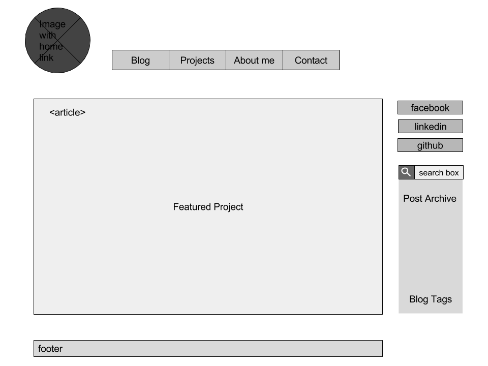

1. What is a wireframe?

A wireframe is like a blueprint for site design and it lets you to map out the information hierarchy of your site. This can be done as a sketch on paper, or with various programs.

2. What are the benefits of wireframing?

Wireframing makes it easier for you to plan your layout based on how you want a user to process the information on your site. Instead of being distracted by color or other choices, it allows you to focus on the layout and interaction of an interface. Wireframing creates a plan for organization before delving into other design choices.

3. Did you enjoy wireframing your site?

I did enjoy wireframing. I liked thinking creatively about how i wanted to organize things and how users would interact with my site.

4. Did you revise your wireframe or stick with your first idea?

I stuck with my first idea.

5. What questions did you ask during this challenge? What resources did you find to help you answer them?

I wondered how i would indicate that my header would also serve as my “home” button. Not sure about this one yet!

6. Which parts of the challenge did you enjoy and which parts did you find tedious?

I enjoyed this challenge. I found wireframing a little tedious.