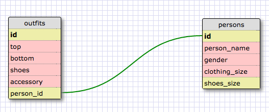

1.
SELECT * FROM states;

2.
SELECT * FROM regions;

3.
SELECT state_name, population FROM states;

4.
SELECT state_name, population
FROM states
ORDER BY population DESC;

5.
SELECT state_name FROM states
WHERE region_id=7;

6.
SELECT state_name, population_density FROM states
WHERE population_density > 50
ORDER BY population_density ASC;

7.
SELECT state_name FROM states
WHERE population > 1000000
AND population < 1500000;

8.
SELECT state_name, region_id FROM states
ORDER BY region_id ASC;

9.
SELECT region_name FROM regions
WHERE region_name LIKE '%Central%';

10.
SELECT regions.region_name, states.state_name FROM regions
INNER JOIN states
ON regions.id=states.region_id;

What are databases for?

Databases are for storing and accessing tables of information.

What is a one-to-many relationship?

A one to many relationship is when you have attributes that are fundamentally different things with a relationship. Specifically you can test for a one to many relationship by using the phrase "____ belongs to a ____. ____ has many ____." If you determine that two of your attributes have a one to many relationship they will work much better as separate tables instead of as different attributes within the same table.

What is a primary key? What is a foreign key? How can you determine which is which?

A primary key is a key in a relational database that is unique for each record. It is a unique identifier, such as a driver license number, telephone number (including area code), or vehicle identification number (VIN). A relational database must always have one and only one primary key. Primary keys typically appear as columns in relational database tables.

In context of relational databases, a foreign key is a field (or collection of fields) in one table that uniquely identifies a row of another table.The foreign key is defined in a second table, but it refers to the primary key in the first table. For example, a table called Employee has a primary key called employee_id. Another table called Employee Details has a foreign key which references employee_id in order to uniquely identify the relationship between both the tables.

How can you select information out of a SQL database? What are some general guidelines for that?

You can select from an SQL database by using commands. SELECT column_name FROM table_name There are also additional commands to specify the data you would like to query.