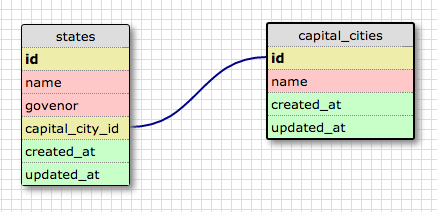
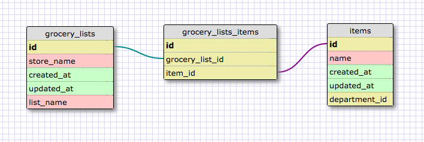

This design demonstrates a one-to-one relationship because a state can have at most one capital city. The capital city does not need to have a field for its state id.

What is a one-to-one database?

One-to-one relationships are used when two things have a single relationship to one another. Essentially, they are a pair.

When would you use a one-to-one database? (Think generally, not in terms of the example you created).

You would use a one-to-one relationship if you have a relationship where a group of fields can all optionally be empty (signified by NULL). Or if you want to split up a table for clarity you can link the two with a one to one relationship

What is a many-to-many database?

A database with two tables that need an additional join table because they both can have multiple of each other.

Two distinct tables are connected by a join table. A join table connects the two independent tables by keeping track of the two ids (foreign keys)

When would you use a many-to-many database? (Think generally, not in terms of the example you created).

You would use a many-to-many database when you have two tables that can have multiple instances of each other.

What is confusing about database schemas? What makes sense?

One to one is definitely confusing and I am still a bit unsure of when it would be 100% neccessary. One to many and many to many make sense.